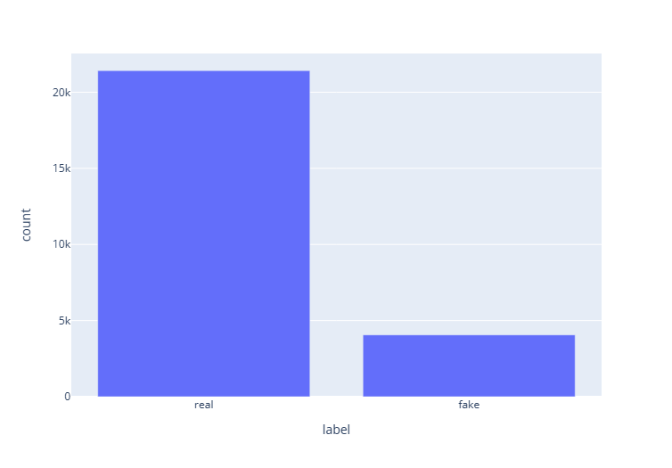

### FAKE NEWS DETECTION 

#### Introduction 

In the rapidly evolving digital age, the proliferation of misinformation has become a pressing issue. The ability to distinguish between real and fake news has never been more critical. This report presents the development and implementation of a machine learning project aimed at detecting fake and real news. The project leverages advanced Natural Language Processing (NLP) techniques and different types of models to analyze and classify news articles.

The project utilizes a dataset of news articles labeled as ‘real’ or ‘fake’, which serves as the foundation for training our machine learning models. The report will delve into the specifics of the data preparation, model training, and evaluation processes, providing a comprehensive overview of the project’s methodology and results. The ultimate goal is to compare few model architecture and analyze which one can assist in the timely and accurate detection of fake news, thereby mitigating its potential harmful effects.

#### Some data insights 

Exploratory data analysis of the dataset was conducted in a notebook and can be found in the ./notebook folder. Here are a few insights:

- it's important to note that the data is unbalanced, which could potentially affect model training and evaluation.

- The subject category appears to be irrelevant and cannot be used in model training.

- We plotted the frequency of words for both categories, but no significant insights were found, except that both categories are related to the name of the US President. However, this could be explained by data sampling and the timing of the sample.

- The most important topics of real news seem to be related to connections between the US President and Russia, focusing on political aspects, while fake news topics revolve around insurance and money, focusing on economic aspects. This aligns with psychological reasoning.

- Sentiment analysis for fake news shows:

  - Positive: 73.62%
  - Negative: 26.38%

- Sentiment analysis for real news shows:

  - Positive: 75.43%
  - Negative: 21.95%
  - Neutral: 2.61%

#### Data preprocessing 

In this project, we employed several data preprocessing techniques to prepare our dataset for the machine learning model. The first step in our preprocessing pipeline was text cleaning. This involved removing unnecessary elements such as special characters from the news articles. We also converted all text to lowercase to maintain consistency and reduce the dimensionality of the data.

Next, we tokenized the text data, which is a process of converting the continuous text into a list of words. The tokenized words were then stemmed using the Porter Stemmer. Stemming is the process of reducing inflected (or sometimes derived) words to their word stem, base or root form. The stemmed words were further filtered by removing the stopwords. Stopwords are a set of commonly used words in a language. Examples of stopwords in English are “a”, “and”, “the”, “in”, and “is”.

After the preprocessing steps, the data was split into training and test sets. This is a common practice in machine learning, where a model is trained on a large portion of the data (the training set), and then the model’s performance is evaluated on a smaller portion of the data that it has not seen before (the test set).

These preprocessing steps helped transform our raw text data into a format that could be effectively used by our machine learning model. The cleaned and tokenized text data, devoid of any stopwords, provided a more focused and relevant set of data for the model to learn from. The use of stemming also helped in reducing the complexity of the model by grouping words with the same roots together.

#### Features engineering 

In this project, we employed a variety of feature engineering techniques to transform the raw text data into a format that could be effectively used by our machine learning models.

- The first approach was using GloVe (Global Vectors for Word Representation), a pre-trained word embedding model. We loaded the GloVe vectors and generated features for our training and test sets. Each text was represented as a 50-dimensional vector, capturing the semantic meaning of the words.

- The second approach was using TF-IDF (Term Frequency-Inverse Document Frequency). This statistical measure reflects how important a word is to a document in a collection or corpus. We used the TfidfVectorizer from the sklearn library to transform our text data into a matrix of TF-IDF features.

- The third approach was using Bag of Words (BoW). This is a representation of text that describes the occurrence of words within a document. We used the CountVectorizer from the sklearn library to convert our text data into a matrix of token counts.

- The final approach was using a transformer model for feature extraction. We tokenized the text data, added special tokens, padded or truncated the sequences to a specified maximum length, and created attention masks. For inference, we followed the same steps but without the labels.

#### Models archeture 

In this project, we utilized a variety of machine learning models to classify news articles as real or fake.

**Random Forest Classifier**. The first model we used was the Random Forest Classifier from the sklearn library. This model operates by constructing a multitude of decision trees at training time and outputting the class that is the mode of the classes of the individual trees. We used 100 estimators and set the random state to 42 for reproducibility.

**Multi-Layer Perceptron (MLP) Classifier**. The second model we employed was the Multi-Layer Perceptron (MLP) Classifier, also from the sklearn library. MLPs are a type of feedforward artificial neural network that consists of at least three layers of nodes: an input layer, a hidden layer, and an output layer. We configured our MLP with two hidden layers, each containing 100 nodes, and used the ‘relu’ activation function and the ‘adam’ solver.

**Tranformer**. The final model we used was the DistilBERT model from the transformers library. DistilBERT is a lighter version of BERT. We fine-tuned this model on our task, using a learning rate of 2e-5 and a batch size that was determined dynamically. To make the model more parameter-efficient and solve memory issue, we used a subset of the model’s parameters for training.

#### Usage

- Data should be placed in `./data` folder.
- Model will be saved in `./models` folder.
- EDA analysis can be found in `./notebooks` folder.
- To prepare the virtual environment and install essential packages, run `./install.sh` (works only for Unix users).
- To train the model, run `python ./src/model_training.py --models <model type>`. This option allows you to choose several models among `mlp, random_forest, and transformer`.
- To infer the model, run `python ./src/model_inference.py --model_file <file from models folder without extension> --input_file <path to CSV file> --output_file <path to CSV file> --feature_engineering ['tfidf', 'bow', 'glove', 'transformer']`.

#### Analysis 

|   Model   | Feature | Precision | Recall  | F1score | Accuracy |  
|:----------------:|:------:|:---------:|:-------:|:-------:|:-----:|
|   Random Forest  |  TF-IDF |   0.99   |  0.99  |  0.99  | 0.9994 |   
|   Random Forest  |  BOW |   0.99   |  0.99  |  0.99  | 0.997 |   
|   Random Forest  |  GloVe |   0.95   |  0.89  |  0.92  | 0.9595 |   
|   Multi-Layer Perceptron    |  TF-IDF |   0.99   |  0.99  |  0.99  | 0.9968 |    
|   Multi-Layer Perceptron    |  BOW |    0.99   |  0.99  |  0.99  | 0.9962 |
|   Multi-Layer Perceptron    |  GloVE |   0.94   |  0.94  |  0.94  | 0.9703 |    
|   Transfromer |  Transfomer |   0.42   |  0.5  |  0.46 | 0.84 |    